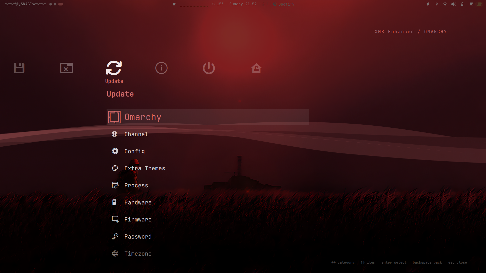
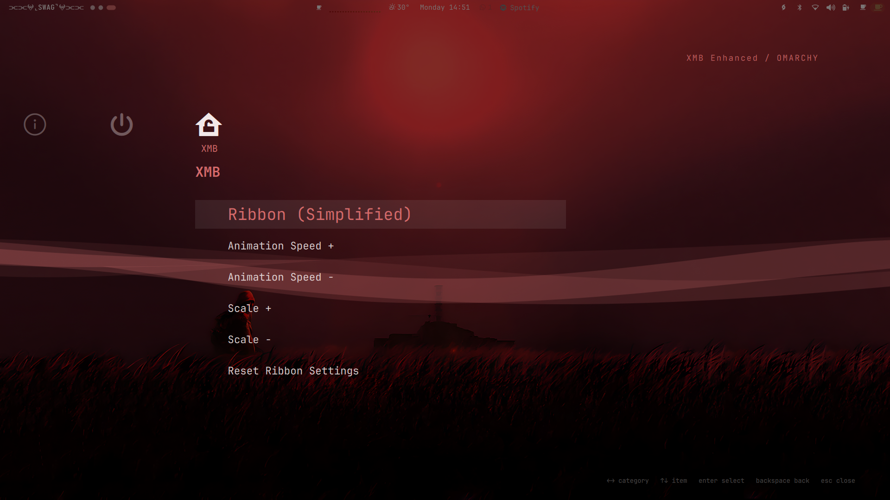

# XMB Enhanced - v1.4

Plugin id: `io.github.sa1ntmar0on.xmb-enhanced`

A XrossMediaBar/XMB-style menu for [Omarchy]: a horizontal row
of category icons with a vertical item column below the selected category,
rendered as a full-screen overlay — the same menu tree, providers, guards, search
and app launching as the built-in `omarchy.menu`, plus an animated mesh-fold
ribbon behind it. This is an Enhanced version.

The headline addition is the ribbon: an animated mesh-fold ribbon behind the
menu, ported from RetroArch's Wii U XMB shader, with menu controls for
visibility, animation speed and scale. See [The ribbon](#the-ribbon).

Everything visual follows the active Omarchy theme, including the ribbon, which
takes the theme's accent colour.

## Screenshots

| Apps | Setup | Ribbon controls |
|------|-------|----------------|
|  |  |  |

## Requirements

- Omarchy with Hyprland
- `omarchy-shell` (Quickshell), provided by Omarchy

## Install

```bash
omarchy plugin add https://github.com/Sa1ntMar0on/XMB-Enhanced.git --enable
```

That's the whole setup. The **XMB** ribbon category is installed with the plugin —
there is nothing to paste into your config.

It works because the plugin ships its own `omarchy-menu.jsonc` and `Xmb.qml`
reads **three** menu sources in precedence order:

```
omarchy's packaged defaults  ->  the plugin's own rows  ->  your overrides
```

Later sources win, so anything you have hand-edited in
`~/.config/omarchy/extensions/omarchy-menu.jsonc` still takes effect.

On install, and on every shell start while the plugin is enabled, it takes over
**SUPER + SPACE**: `hl.unbind` + `o.bind` are appended to
`~/.config/hypr/bindings.lua` inside an auto-managed marked block. Disabling
(`omarchy plugin disable io.github.sa1ntmar0on.xmb-enhanced`) or removing the plugin rewrites
the file without the block, restoring the stock Omarchy menu binding. If the
plugin is gone while the block somehow remains, the bound command detects it via
a ping and falls back to `omarchy-menu toggle root`, so the key never dies.

> If the menu ever stops responding to SUPER + SPACE after editing plugin code,
> run `omarchy restart shell`. A plugin that failed to load stays cached, and a
> cached failure makes the keybinding fall back to the stock menu until the
> shell process is replaced.

## Summon

```bash
omarchy-shell shell summon io.github.sa1ntmar0on.xmb-enhanced '{"menu":"root"}'
omarchy-shell shell toggle io.github.sa1ntmar0on.xmb-enhanced
omarchy-shell shell hide io.github.sa1ntmar0on.xmb-enhanced
```

The payload accepts `{"menu":"<id|alias>"}` to open a specific route, using the
same ids and aliases as `omarchy menu summon`.

## Keys

| Key | Action |
|-----|--------|
| Left / Right | Previous / next root category (wraps) |
| Up / Down | Move selection in the item column |
| Page Up / Page Down | Jump six rows |
| Enter | Run action, launch app, or drill into a submenu |
| Backspace | Back one level (or clear the filter) |
| Escape | Clear filter, then back, then close |
| Type | Filter — the whole tree at category level, the open subtree inside a submenu |
| Delete | Uninstall the selected app (with confirm) |
| Click / Wheel | Select and activate with the pointer |

## The ribbon

An animated mesh-fold ribbon behind the menu, ported from RetroArch's Wii U XMB
shader (`menu_shaders/ribbon_simple.c`, originally by Ali Bouhlel).

A mesh is displaced vertically by smooth noise plus a cosine, and its rows are
drawn **additively** on top of each other. Where the mesh folds over itself the
brightness accumulates, so the folds glow and the flat spans stay dim — the
ribbon is drawn by overlap density, not by any stroke or gradient. It is a
transparent overlay: it paints no background of its own and never covers the
wallpaper.

The displacement is the shader line, unchanged:

```
h = noise2(vec2(x + time/2, y*3)) * 0.25
  + cos(2.0 * (x + y/3 + time)) * 0.1
```

Defaults: speed `1.0`, scale `0.80`, brightness `0.10`, mesh `128x96`, 30fps.
A full wave cycle takes about 3.1 seconds at the default speed.

## Ribbon settings reference

The rows in the plugin's `omarchy-menu.jsonc` drive these values:

| Setting | Range | Default |
|---------|-------|---------|
| Visibility | on / off | on |
| Animation speed | 0.2 – 3.0 | 1.0 |
| Scale | 0.4 – 1.6 | 0.80 |

| Row | Effect |
|-----|--------|
| **XMB** | Opens this submenu |
| **Ribbon (Simplified)** | Shows/hides the ribbon; ✓ when on |
| **Animation Speed + / -** | Steps speed by 0.2, clamped to 0.2 – 3.0 |
| **Scale + / -** | Steps scale by 0.1, clamped to 0.4 – 1.6 |
| **Reset Ribbon Settings** | Restores speed, scale and visibility to defaults |

### Changing the labels

Edit `omarchy-menu.jsonc` in the plugin directory. To override a row from your
own config instead, add it to `~/.config/omarchy/extensions/omarchy-menu.jsonc`
with the same dotted id:

```jsonc
{
  "xmb.ribbon": {
    "label": "Waves",
    "description": "Show or hide the wave",
    "action": "bash ~/.config/omarchy/plugins/io.github.sa1ntmar0on.xmb-enhanced/ribbon.sh toggle",
    "checked": "bash ~/.config/omarchy/plugins/io.github.sa1ntmar0on.xmb-enhanced/ribbon.sh | grep -q '^visible=on$'"
  }
}
```

> **Override a row completely.** Omarchy normalises every field, so a partial
> override sends an empty `action` — which *replaces* the plugin's rather than
> merging with it, leaving a dead row. When overriding, restate `action` (and
> `checked`, if you want the tick) as shown above. This is stock omarchy menu
> behaviour, not specific to this plugin.

### ribbon.sh

Settings are owned by a small script rather than by the plugin process, because
`omarchy-shell shell call` only reaches a plugin while its loader happens to be
mounted — a menu row driving the plugin directly would silently do nothing while
the menu is closed, which is exactly when it needs to work. `Xmb.qml` re-reads
the settings every time the menu opens.

```bash
ribbon.sh                      # print everything as KEY=VALUE lines
ribbon.sh toggle               # flip the ribbon on/off
ribbon.sh on | off             # set visibility explicitly
ribbon.sh speed <value>        # set speed, e.g. 1.5
ribbon.sh speed + | -          # step the speed
ribbon.sh scale <value>        # set scale, e.g. 1.2
ribbon.sh scale + | -          # step the scale
ribbon.sh reset                # restore defaults
```

State lives in `~/.local/state/omarchy/xmb-ribbon/` as plain one-value-per-file
tokens, so it is trivial to inspect or edit by hand.

## Theme

Colours come from the shell's shared `Color` singleton, so theme switches apply
live:

- the ribbon uses `Color.accent`
- the scrim is neutral black at 50%, so the wallpaper reads through it without
  picking up a colour cast
- menu surfaces and text use `menu.*` from the theme's `shell.toml`, falling back
  to the foundational palette from `colors.toml`

If the ribbon looks white on a themed system, that theme ships no `shell.toml`,
so `Color.accent` falls back to the default. Adding a `shell.toml` to the theme
fixes it at the source.

## Apps provider

Uses the shell's shared `AppLibrary` (desktop entries with icons, launch
feedback, uninstall) when the host wires it for this plugin. When it does not
(third-party menu plugins can get a scoped shell whose `appLibrary` is null),
Apps falls back to the bundled `apps-list.sh`, which enumerates
`$XDG_DATA_HOME/applications`, `/usr/share/applications` and the flatpak export
dirs — filtered with the shell's `hidden-entries.sh` and omarchy's
`launcher.hides` junk list, so the list matches the omarchy launcher. Launch goes
through `uwsm-app -- gtk-launch <id>.desktop`; uninstall (Delete key) through
`omarchy-remove-launcher-entry`. The list re-enumerates every time you enter the
Apps category.

## Menu data

Read from `$OMARCHY_PATH/default/omarchy/omarchy-menu.jsonc` and
`~/.config/omarchy/extensions/omarchy-menu.jsonc`; both are watched and
hot-reload. `XmbModel.js` is a copy of the shell's `MenuModel.js`; refresh it
from `/usr/share/omarchy/shell/plugins/menu/MenuModel.js` after an Omarchy
update if menu parsing behaviour changes upstream.

Apart from the ribbon settings directory, the plugin keeps no state files (the
plugin directory is watched by the registry).

## Credits

- Ribbon shader: RetroArch, `menu_shaders/ribbon_simple.c` — Ali Bouhlel, GPL-2.0
- Base plugin: [fab679/omarchy-xmb](https://github.com/fab679/omarchy-xmb)
