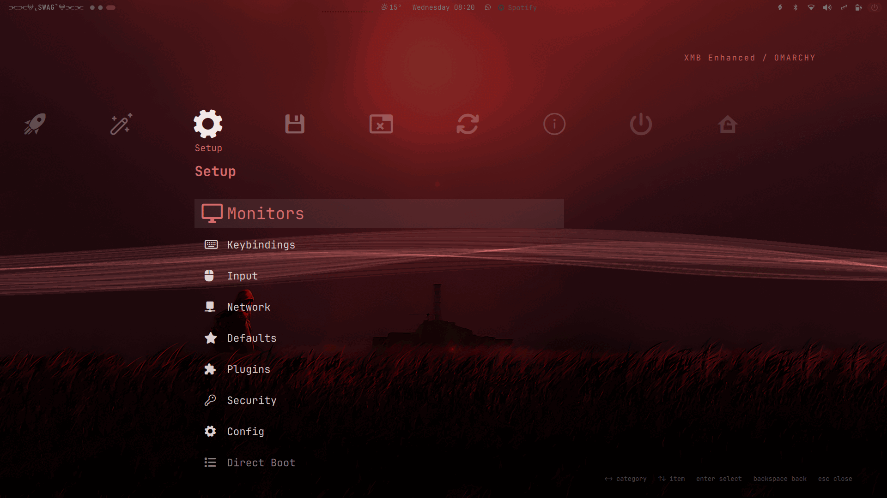
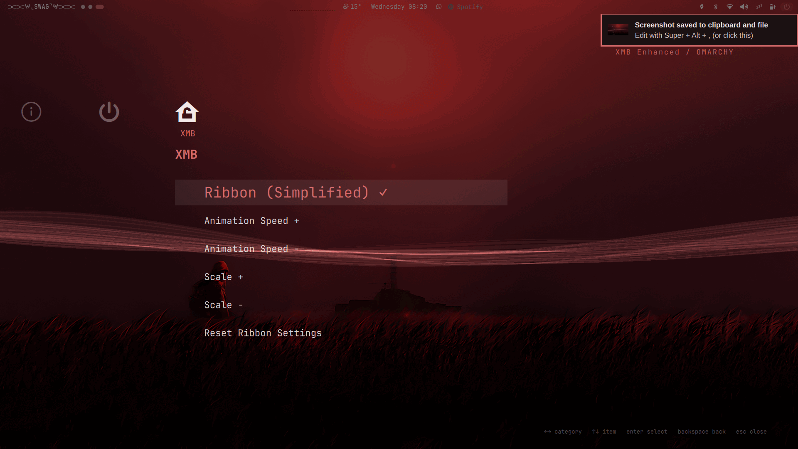

# XMB Enhanced - v1.6

Plugin id: `io.github.sa1ntmar0on.xmb-enhanced`

A XrossMediaBar/XMB-style menu for Omarchy: a horizontal row
of category icons with a vertical item column below the selected category,
rendered as a full-screen overlay — the same menu tree, providers, guards, search
and app launching as the built-in `omarchy.menu`, plus an animated mesh-fold
ribbon behind it. This is an Enhanced version.

The headline addition is the ribbon: an animated mesh-fold ribbon behind the
menu, modelled on the Ps3 XMB, with menu controls for visibility, animation
speed and scale. See [The ribbon](#the-ribbon).

Everything visual follows the active Omarchy theme, including the ribbon, which
takes the theme's accent colour.

## Screenshots

| Apps | Setup | Ribbon controls|
|------|-------|----------------|
|  |  |  |

## What's new in v1.6

A performance pass on the ribbon, which animated at about **213% of one CPU
core** in v1.5. Now **~81%**.

The cost is almost entirely rasterization: every mesh row is a separate fill,
drawn additively on top of the others. Three changes, measured in real
Quickshell rather than estimated:

| | Before | After |
|---|---|---|
| Mesh rows | 96 (95 strips) | 41 (40 strips) |
| Strip overlap | 3.5px | 2px |
| Antialiasing | on | off |

Halving the rows left brightness unchanged (mean luminance 21.5–22.6 across
every density tested), so this is less work for the same picture — not a dimmer
ribbon traded for speed. The overlap and antialiasing changes remove the seams
between strips, which is what antialiasing was paying for.

Brightness stayed at `0.10` on purpose. It was tuned when strips overlapped by
3.5px, which filled each strip twice and made the ribbon glow at an effective
`0.20`. With a 2px overlap `0.10` is a real `0.10` again.

Menu wording: `Ribbon (Simplified)` is now `Show/Hide Ribbon` — it wasn't
simplified, it ran well.

Menu layout, also in v1.6:

- The selected root icon is drawn at **2×**; the rest stay at 1×.
- Items scrolling up behind the icon row now **fade out** instead of printing
  over the glyphs. The item column starts above the icon row (`colTop` is 0.12 of
  the content height, the icon row centre is 0.25), so the top ~4 rows genuinely
  overlapped it. The old fade was measured against the list's own viewport, which
  is not the same edge, so it read 1.0 while still on top of the icons.
- The label under the selected icon is **gone**. It repeated the category name
  that the bold heading above the item column already shows, so every category
  name appeared twice.
- The `XMB Settings` category has an icon (`nf-md-home_lock_open`).

## Requirements

- Omarchy with Hyprland
- `omarchy-shell` (Quickshell), provided by Omarchy

## Install

```bash
omarchy plugin add https://github.com/Sa1ntMar0on/XMB-Enhanced.git --enable
```

That's the whole setup. The **XMB** ribbon category is installed with the plugin —
there is nothing to paste into your config.

It works because the plugin ships its own `omarchy-menu.jsonc` and `Xmb.qml`
reads **three** menu sources in precedence order:

```
omarchy's packaged defaults  ->  the plugin's own rows  ->  your overrides
```

Later sources win, so anything you have hand-edited in
`~/.config/omarchy/extensions/omarchy-menu.jsonc` still takes effect.

## What this plugin changes on your system

Installing and enabling this plugin does three things automatically, with no
prompt. They are listed here so nothing is a surprise — all three are
reversible.

**1. It takes over `SUPER + SPACE`.**

A marked block is appended to the end of `~/.config/hypr/bindings.lua`:

```lua
-- BEGIN io.github.sa1ntmar0on.xmb-enhanced SUPER+SPACE takeover (auto-managed)
hl.unbind("SUPER + SPACE")
o.bind("SUPER + SPACE", "XMB menu", "...omarchy-shell shell toggle ...")
-- END io.github.sa1ntmar0on.xmb-enhanced SUPER+SPACE takeover (auto-managed)
```

- Your existing bindings are **not** modified, reordered or removed. The block
  is appended after them, and Hyprland reads the file top-to-bottom, so the
  unbind takes effect over the stock binding.
- The block is rewritten in place on every shell start rather than appended
  repeatedly, so it cannot stack up.
- It is removed again by `omarchy plugin disable`, `omarchy plugin remove`, or
  by deleting the plugin directory. After a release the file is byte-identical
  to what it was before.
- If you prefer to manage it yourself, delete the two marker lines and the three
  lines between them; the plugin will re-add them on the next shell start unless
  you also disable it.
- If `~/.config/hypr/bindings.lua` does not exist, the plugin creates it. On a
  normal Omarchy install it already exists, so this only matters if you removed
  it yourself.

**2. It creates its own state directory.**

```
~/.local/state/omarchy/xmb-ribbon/{visible,speed,scale}
```

Three small files holding your ribbon preferences. This is the plugin's own
state, in the same place Omarchy keeps plugin state. Delete the directory to
reset the ribbon to defaults.

**3. It does not write to your menu config.**

You do **not** need to add anything to
`~/.config/omarchy/extensions/omarchy-menu.jsonc`. The ribbon controls ship
inside the plugin and are read from there. If that file does not exist, the
plugin does not create it.

**Those three are the only writes.** The plugin does not touch your Hyprland
config beyond the marked block above, does not modify omarchy's packaged
defaults, and reads every menu source read-only.

## Troubleshooting

On install, and on every shell start while the plugin is enabled, the keybinding
above is refreshed.

> If the menu ever stops responding to SUPER + SPACE after editing plugin code,
> run `omarchy restart shell`. A plugin that failed to load stays cached, and a
> cached failure makes the keybinding fall back to the stock menu until the
> shell process is replaced.

## Summon

```bash
omarchy-shell shell summon io.github.sa1ntmar0on.xmb-enhanced '{"menu":"root"}'
omarchy-shell shell toggle io.github.sa1ntmar0on.xmb-enhanced
omarchy-shell shell hide io.github.sa1ntmar0on.xmb-enhanced
```

The payload accepts `{"menu":"<id|alias>"}` to open a specific route, using the
same ids and aliases as `omarchy menu summon`.

## Keys

| Key | Action |
|-----|--------|
| Left / Right | Previous / next root category (wraps) |
| Up / Down | Move selection in the item column |
| Page Up / Page Down | Jump six rows |
| Enter | Run action, launch app, or drill into a submenu |
| Backspace | Back one level (or clear the filter) |
| Escape | Clear filter, then back, then close |
| Type | Filter — the whole tree at category level, the open subtree inside a submenu |
| Delete | Uninstall the selected app (with confirm) |
| Click / Wheel | Select and activate with the pointer |

## The ribbon

An animated mesh-fold ribbon behind the menu, modelled on the Ps3 XMB.

A mesh is displaced vertically by smooth noise plus a cosine, and its rows are
drawn **additively** on top of each other. Where the mesh folds over itself the
brightness accumulates, so the folds glow and the flat spans stay dim — the
ribbon is drawn by overlap density, not by any stroke or gradient. It is a
transparent overlay: it paints no background of its own and never covers the
wallpaper.

The displacement is the shader line, unchanged:

```
h = noise2(vec2(x + time/2, y*3)) * 0.25
  + cos(2.0 * (x + y/3 + time)) * 0.1
```

Defaults: speed `1.0`, scale `0.80`, brightness `0.10`, mesh `128x41` (40 strips),
2px strip overlap, no antialiasing, 30fps. A full wave cycle takes about 3.1
seconds at the default speed.

`rows` is the cost dial (CPU is roughly linear in it), `overlap` must stay >= 1 or
the background shows through as hairline seams, and `strength` is brightness
only — a pure alpha change, so it costs nothing.

## Ribbon settings reference

The rows in the plugin's `omarchy-menu.jsonc` drive these values:

| Setting | Range | Default |
|---------|-------|---------|
| Visibility | on / off | on |
| Animation speed | 0.2 – 3.0 | 1.0 |
| Scale | 0.4 – 1.6 | 0.80 |

| Row | Effect |
|-----|--------|
| **XMB Settings** | Opens this submenu |
| **Show/Hide Ribbon** | Shows/hides the ribbon; ✓ when on |
| **Animation Speed + / -** | Steps speed by 0.2, clamped to 0.2 – 3.0 |
| **Scale + / -** | Steps scale by 0.1, clamped to 0.4 – 1.6 |
| **Reset the Ribbons Settings** | Restores speed, scale and visibility to defaults |

### Changing the labels

Edit `omarchy-menu.jsonc` in the plugin directory. To override a row from your
own config instead, add it to `~/.config/omarchy/extensions/omarchy-menu.jsonc`
with the same dotted id:

```jsonc
{
  "xmb.ribbon": {
    "label": "Waves",
    "description": "Show or hide the wave",
    "action": "bash ~/.config/omarchy/plugins/io.github.sa1ntmar0on.xmb-enhanced/ribbon.sh toggle",
    "checked": "bash ~/.config/omarchy/plugins/io.github.sa1ntmar0on.xmb-enhanced/ribbon.sh | grep -q '^visible=on$'"
  }
}
```

> **Override a row completely.** Omarchy normalises every field, so a partial
> override sends an empty `action` — which *replaces* the plugin's rather than
> merging with it, leaving a dead row. When overriding, restate `action` (and
> `checked`, if you want the tick) as shown above. This is stock omarchy menu
> behaviour, not specific to this plugin.

### ribbon.sh

Settings are owned by a small script rather than by the plugin process, because
`omarchy-shell shell call` only reaches a plugin while its loader happens to be
mounted — a menu row driving the plugin directly would silently do nothing while
the menu is closed, which is exactly when it needs to work. `Xmb.qml` re-reads
the settings every time the menu opens.

```bash
ribbon.sh                      # print everything as KEY=VALUE lines
ribbon.sh toggle               # flip the ribbon on/off
ribbon.sh on | off             # set visibility explicitly
ribbon.sh speed <value>        # set speed, e.g. 1.5
ribbon.sh speed + | -          # step the speed
ribbon.sh scale <value>        # set scale, e.g. 1.2
ribbon.sh scale + | -          # step the scale
ribbon.sh reset                # restore defaults
```

State lives in `~/.local/state/omarchy/xmb-ribbon/` as plain one-value-per-file
tokens, so it is trivial to inspect or edit by hand.

## Theme

Colours come from the shell's shared `Color` singleton, so theme switches apply
live:

- the ribbon uses `Color.accent`
- the scrim is neutral black at 50%, so the wallpaper reads through it without
  picking up a colour cast
- menu surfaces and text use `menu.*` from the theme's `shell.toml`, falling back
  to the foundational palette from `colors.toml`

If the ribbon looks white on a themed system, that theme ships no `shell.toml`,
so `Color.accent` falls back to the default. Adding a `shell.toml` to the theme
fixes it at the source.

## Apps provider

Uses the shell's shared `AppLibrary` (desktop entries with icons, launch
feedback, uninstall) when the host wires it for this plugin. When it does not
(third-party menu plugins can get a scoped shell whose `appLibrary` is null),
Apps falls back to the bundled `apps-list.sh`, which enumerates
`$XDG_DATA_HOME/applications`, `/usr/share/applications` and the flatpak export
dirs — filtered with the shell's `hidden-entries.sh` and omarchy's
`launcher.hides` junk list, so the list matches the omarchy launcher. Launch goes
through `uwsm-app -- gtk-launch <id>.desktop`; uninstall (Delete key) through
`omarchy-remove-launcher-entry`. The list re-enumerates every time you enter the
Apps category.

## Menu data

Read from `$OMARCHY_PATH/default/omarchy/omarchy-menu.jsonc` and
`~/.config/omarchy/extensions/omarchy-menu.jsonc`; both are watched and
hot-reload. `XmbModel.js` is a copy of the shell's `MenuModel.js`; refresh it
from `/usr/share/omarchy/shell/plugins/menu/MenuModel.js` after an Omarchy
update if menu parsing behaviour changes upstream.

Apart from the ribbon settings directory, the plugin keeps no state files (the
plugin directory is watched by the registry).

## Credits

- Ribbon shader: RetroArch, `menu_shaders/ribbon_simple.c` — Ali Bouhlel, GPL-2.0
- Base plugin: [fab679/omarchy-xmb](https://github.com/fab679/omarchy-xmb)

## Licence

**GPL-2.0.** See [LICENSE](LICENSE).

Not a choice so much as a consequence: `XmbRibbon.qml` ports the displacement
shader from RetroArch's `menu_shaders/ribbon_simple.c` (Ali Bouhlel), which is
GPL-2.0. GPL-2.0 is incompatible with MIT, so the plugin as a whole cannot be
MIT-licensed while that code is in it.

The menu itself — `Xmb.qml`, `XmbModel.js`, `apps-list.sh`, `keybinding.sh` — is
derived from fab679's MIT-licensed XMB plugin, and those MIT notices are
preserved in the LICENSE file.

If you fork this and want MIT back, the ribbon has to be reimplemented from the
technique (mesh-fold displacement, additive density) rather than ported from the
shader. The technique is not anyone's copyright; the specific code is.

## Removing it

```bash
omarchy plugin remove io.github.sa1ntmar0on.xmb-enhanced
```

That is the whole removal. It disables the plugin, unloads it from
`omarchy-shell`, and deletes the plugin folder — the binding takeover is
released at the same time, so `SUPER + SPACE` goes back to the stock Omarchy
menu and your `~/.config/hypr/bindings.lua` is left without the auto-managed
block. Pass `--yes` to skip the confirmation prompt.

To remove it and reinstall a clean copy later, note that the plugin directory
is not kept: `omarchy plugin add` clones fresh from GitHub either way.

The ribbon settings directory is not touched by removal, so your last speed,
scale and visibility choices are still there if you reinstall:

```bash
# Optional: forget the saved ribbon settings too
rm -rf ~/.local/state/omarchy/xmb-ribbon
```

Nothing else is written outside the plugin folder and that settings
directory, so those two paths are the complete footprint.

To keep the plugin but turn it off, disable it instead — the menu and the
`SUPER + SPACE` takeover are both released, and the folder stays put:

```bash
omarchy plugin disable io.github.sa1ntmar0on.xmb-enhanced
omarchy plugin enable  io.github.sa1ntmar0on.xmb-enhanced   # back again
```

If you ever disable or remove the plugin while `omarchy-shell` is not
running, the release cannot fire and the managed block is left behind. The
hotkey still works — it falls back to the stock menu — but you can clear the
block by hand:

```bash
bash ~/.config/omarchy/plugins/io.github.sa1ntmar0on.xmb-enhanced/keybinding.sh release
hyprctl reload
```

To check whether the block is currently in your bindings file:

```bash
grep -c "XMB menu" ~/.config/hypr/bindings.lua
```
