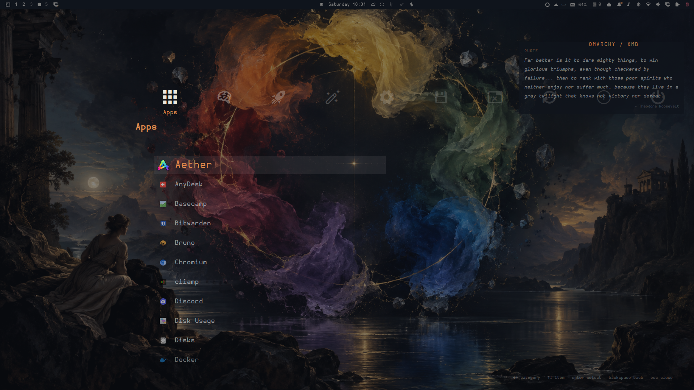
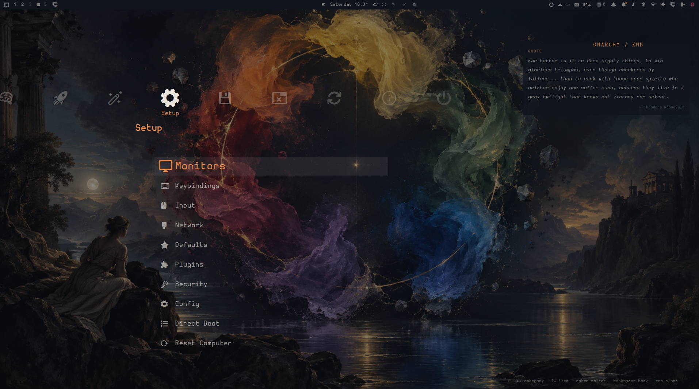

# io.github.fab679.xmb

XrossMediaBar-style Omarchy menu. A horizontal row of category icons with a
vertical item column below the selected category, rendered as a full-screen
overlay — the same menu tree, providers, guards, search, and app launching as
the built-in `omarchy.menu`, styled entirely from the active theme.

## Screenshots

| Apps | Setup |
|------|-------|
|  |  |

## Install

```
omarchy plugin add https://github.com/fab679/omarchy-xmb.git --enable
```

On install (and on every shell start while enabled), the plugin takes over
**SUPER + SPACE**: `hl.unbind` + `o.bind` are appended to
`~/.config/hypr/bindings.lua` inside an auto-managed marked block. Disabling
(`omarchy plugin disable io.github.fab679.xmb`) or removing the plugin rewrites the file
without the block, restoring the stock Omarchy menu binding. If the plugin is
gone while the block somehow remains, the bound command detects it via a ping
and falls back to `omarchy-menu toggle root`, so the key never dies.

## Summon

```
omarchy-shell shell summon io.github.fab679.xmb '{"menu":"root"}'
omarchy-shell shell toggle io.github.fab679.xmb
omarchy-shell shell hide io.github.fab679.xmb
```

Payload accepts `{"menu":"<id|alias>"}` to open a specific route (same ids and
aliases as `omarchy menu summon`).

## Keys

| Key | Action |
|-----|--------|
| Left / Right | Previous / next root category (wraps) |
| Up / Down | Move selection in the item column |
| Enter | Run action, launch app, or drill into a submenu |
| Backspace | Back one level (or edit the filter) |
| Escape | Clear filter, then back, then close |
| Type | Filter — the whole tree at category level, the open subtree inside a submenu |
| Delete | Uninstall the selected app (with confirm) |
| Click / Wheel | Select and activate with the pointer |

## Theme

Colors come from the shared `Color` singleton (`menu.*` surfaces from the
theme's `shell.toml`, foundational palette from `colors.toml`), so theme
switches apply live, same as the rest of the shell.

## Apps provider

Uses the shell's shared `AppLibrary` (desktop entries with icons, launch
feedback, uninstall) when the host wires it for this plugin. When it does not
(third-party menu plugins get a scoped shell whose `appLibrary` can be null),
Apps falls back to the bundled `apps-list.sh`, which enumerates
`$XDG_DATA_HOME/applications`, `/usr/share/applications`, and the flatpak
export dirs — filtered with the shell's `hidden-entries.sh` and omarchy's
`launcher.hides` junk list, so the list matches the omarchy launcher. Launch
goes through `uwsm-app -- gtk-launch <id>.desktop`; uninstall (Delete key)
through `omarchy-remove-launcher-entry`. The list re-enumerates every time you
enter the Apps category.

## Menu data

Read from `$OMARCHY_PATH/default/omarchy/omarchy-menu.jsonc` and
`~/.config/omarchy/extensions/omarchy-menu.jsonc`; both are watched and
hot-reload. `XmbModel.js` is a copy of the shell's `MenuModel.js`; refresh it
from `/usr/share/omarchy/shell/plugins/menu/MenuModel.js` after omarchy updates
if menu parsing behavior changes upstream.

The plugin keeps no state files (the plugin directory is watched by the
registry).